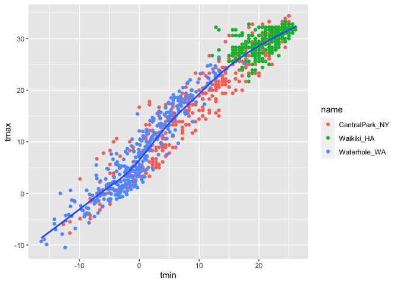
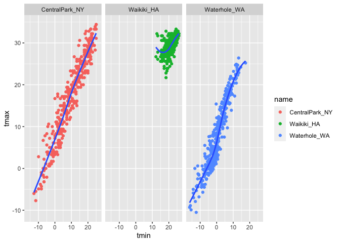
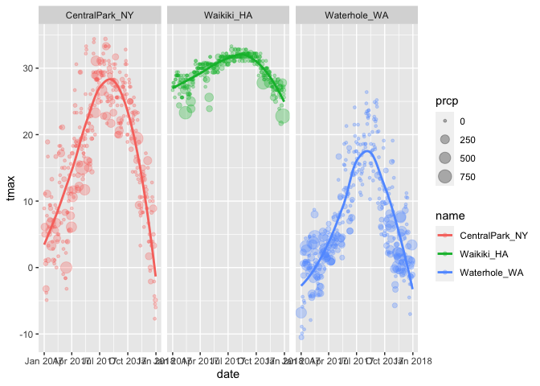
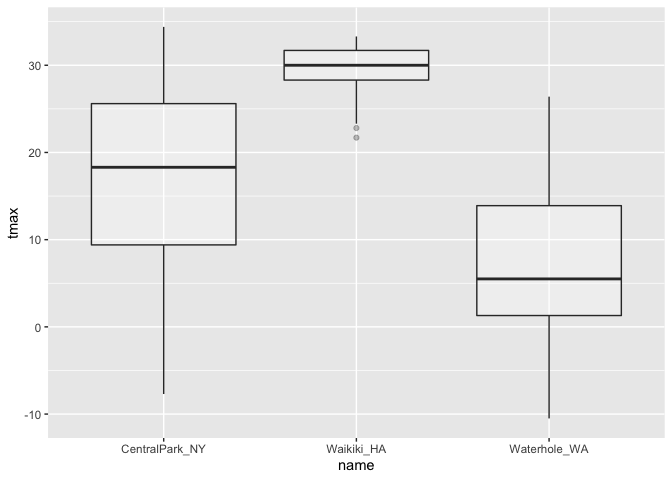
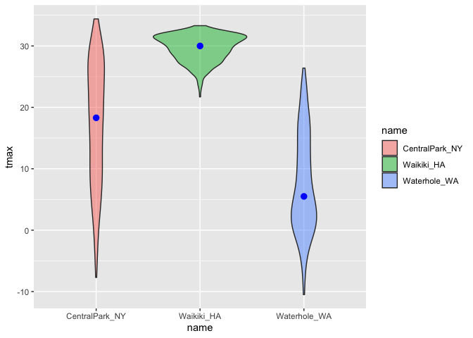

Viz and Eda
================

\##Viz and Eda

``` r
library(tidyverse)
```

    ## ── Attaching packages ─────────────────────────────────────── tidyverse 1.3.2 ──
    ## ✔ ggplot2 3.3.6      ✔ purrr   0.3.4 
    ## ✔ tibble  3.1.8      ✔ dplyr   1.0.10
    ## ✔ tidyr   1.2.1      ✔ stringr 1.4.1 
    ## ✔ readr   2.1.2      ✔ forcats 0.5.2 
    ## ── Conflicts ────────────────────────────────────────── tidyverse_conflicts() ──
    ## ✖ dplyr::filter() masks stats::filter()
    ## ✖ dplyr::lag()    masks stats::lag()

``` r
library(ggridges)
```

## Let’s import data

``` r
weather_df = 
  rnoaa::meteo_pull_monitors(
    c("USW00094728", "USC00519397", "USS0023B17S"),
    var = c("PRCP", "TMIN", "TMAX"), 
    date_min = "2017-01-01",
    date_max = "2017-12-31") %>%
  mutate(
    name = recode(
      id, 
      USW00094728 = "CentralPark_NY", 
      USC00519397 = "Waikiki_HA",
      USS0023B17S = "Waterhole_WA"),
    tmin = tmin / 10, # degree C
    tmax = tmax / 10) %>%
  select(name, id, everything())
```

    ## Registered S3 method overwritten by 'hoardr':
    ##   method           from
    ##   print.cache_info httr

    ## using cached file: ~/Library/Caches/R/noaa_ghcnd/USW00094728.dly

    ## date created (size, mb): 2022-09-29 10:31:45 (8.401)

    ## file min/max dates: 1869-01-01 / 2022-09-30

    ## using cached file: ~/Library/Caches/R/noaa_ghcnd/USC00519397.dly

    ## date created (size, mb): 2022-09-29 10:31:50 (1.699)

    ## file min/max dates: 1965-01-01 / 2020-03-31

    ## using cached file: ~/Library/Caches/R/noaa_ghcnd/USS0023B17S.dly

    ## date created (size, mb): 2022-09-29 10:31:53 (0.95)

    ## file min/max dates: 1999-09-01 / 2022-09-30

Let’s make a scatter plot

``` r
ggplot(weather_df, aes(x=tmin, y= tmax)) + geom_point()
```

    ## Warning: Removed 15 rows containing missing values (geom_point).

<!-- --> Let’s
make the same scatter plot, but different

``` r
weather_df %>% 
drop_na() %>% 
ggplot(aes(x=tmin, y=tmax))+ geom_point()
```

<!-- --> Let’s
keep making the same plot but different

``` r
weather_scatterplot = weather_df %>% drop_na() %>% ggplot(aes(x=tmin, y=tmax))
weather_scatterplot+geom_point()
```

<!-- -->

## Let’s fancy this up a little bit

``` r
ggplot(weather_df, aes(x = tmin, y = tmax)) + 
  geom_point(aes(color = name))
```

    ## Warning: Removed 15 rows containing missing values (geom_point).

<!-- -->

``` r
ggplot(weather_df, aes(x = tmin, y = tmax))+
  geom_point(aes(color = name)) +
  geom_smooth(se = FALSE)# se: CI level display?
```

    ## `geom_smooth()` using method = 'gam' and formula 'y ~ s(x, bs = "cs")'

    ## Warning: Removed 15 rows containing non-finite values (stat_smooth).

    ## Warning: Removed 15 rows containing missing values (geom_point).

<!-- -->

Make seperate panels

``` r
ggplot(weather_df, aes(x = tmin, y = tmax))+
  geom_point(aes(color = name)) +
  geom_smooth(se = FALSE)+
  facet_grid(.~ name) # facet by row ~  facet by coln
```

    ## `geom_smooth()` using method = 'loess' and formula 'y ~ x'

    ## Warning: Removed 15 rows containing non-finite values (stat_smooth).

    ## Warning: Removed 15 rows containing missing values (geom_point).

<!-- -->

Let’s spice it up some

``` r
weather_df %>% 
  ggplot(aes(x= date, y=tmax,color=name))+
  geom_point(aes(size=prcp),alpha=.3)+
  geom_smooth(se=FALSE)+
  facet_grid(.~ name)
```

    ## `geom_smooth()` using method = 'loess' and formula 'y ~ x'

    ## Warning: Removed 3 rows containing non-finite values (stat_smooth).

    ## Warning: Removed 3 rows containing missing values (geom_point).

<!-- -->

``` r
ggplot(weather_df, aes(x = tmax, y = tmin)) + 
  geom_hex()
```

    ## Warning: Removed 15 rows containing non-finite values (stat_binhex).

<!-- -->

\##Univariate plots Histograms, barplots, boxplots,violins…

``` r
weather_df %>% 
  ggplot(aes(x=tmax))+
  geom_histogram()
```

    ## `stat_bin()` using `bins = 30`. Pick better value with `binwidth`.

    ## Warning: Removed 3 rows containing non-finite values (stat_bin).

<!-- -->

more options

``` r
weather_df %>% 
  ggplot(aes(x=tmax,fill=name))+
  geom_density(alpha =.3)
```

    ## Warning: Removed 3 rows containing non-finite values (stat_density).

<!-- -->

boxplots

``` r
weather_df %>% 
  ggplot(aes(x= name, y= tmax), fill=name)+
  geom_boxplot(alpha =.3)
```

    ## Warning: Removed 3 rows containing non-finite values (stat_boxplot).

<!-- -->

violin plots

``` r
ggplot(weather_df, aes(x = name, y = tmax)) + 
  geom_violin(aes(fill = name), alpha = .5) + 
  stat_summary(fun = "median", color = "blue")
```

    ## Warning: Removed 3 rows containing non-finite values (stat_ydensity).

    ## Warning: Removed 3 rows containing non-finite values (stat_summary).

    ## Warning: Removed 3 rows containing missing values (geom_segment).

<!-- -->

ridge plots

``` r
weather_df %>% 
  ggplot(aes(x=tmax, y=name))+
  geom_density_ridges()
```

    ## Picking joint bandwidth of 1.84

    ## Warning: Removed 3 rows containing non-finite values (stat_density_ridges).

<!-- -->
